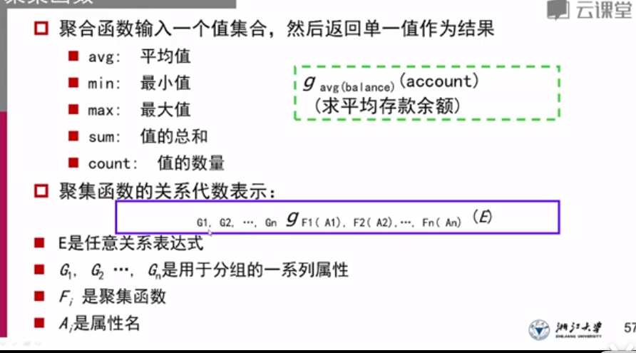

# 关系模型

 ## 关系

关系`r`代表一系列集合笛卡尔积的子集，因此关系是一组n元组的集合


> 即：在第`j`组n元组中，第`i`个元素属于D~i~

假设集合一共有5个，每个集合分别有1,2,3,4,5个元素，那么关系r最多可以有`1*2*3*4*5 = 120`个元组


### 属性

关系的每个集合叫做属性

#### 域

每个属性的取值的集合称为属性的域

null是所有域的成员

属性分为原子属性，多值属性（一个人可以有多个手机号）和复合属性（姓名分为姓和名）


### 关系模式pattern

描述关系的结构，也就是数据库的表头，包括了属性的名称和属性的类型


### 关系实例instance

所包含的特定的一组行

> 关系 = 变量
>
> 关系模式 = 变量类型
>
> 关系实例 = 变量值


访问元组`t`中的某个特定的属性：

```sql
t[name]
```

元组里元素的顺序是无所谓的，但一个关系中<font color=red>不能有重复的元组</font>


## 码键

### 超码，候选码，主键

1. 能够在一个关系中唯一标志一个元组，则属性K是元组R的超码
2. 最小的超码，是候选码
3. 候选码中由用户定义，选择一个作为主键

> 主键通常用下划线标记


### 外键

#### 定义


`学生`表中的`专业号`属性，在`专业`表中是主键，但在学生中不是主键

则`学生`这个表称为**<u>参照关系</u>**，`专业`这个表称为**<u>被参照关系，</u>**`专业号`这个属性称为外键/外码


#### 要求

1. 参照关系（`学生`）中，外码的值必须在被参照关系（`专业`）中实际存在或者为null，也就是说，每录入一个学生的数据元组，则这个元组中`专业号`属性必须在`专业`表中存在，或者只能录入null


# 查询语言

六个基本运算

```mysql
select # 选择
project # 投影
union # 并
set difference # 集合差
rename # 重命名/更名
Cartesian prodect # 笛卡尔积
```

四个附加操作

```mysql
set intersection # 交
natural join # 自然连接
division # 除
assignment # 赋值
```

## 具体操作

```mysql
select dept_name = "Apple"

```

1. 投影：筛选指定的列，并将筛选后的结果中删去重复的行

   > 比如：从学生信息表中投影“学号”和“上课教室”两个属性列，就可能会出现一个学号对应很多重复的教室，此时仅会保留一个结果，删除重复的元组

2. 并运算`∪`

   1. 条件
      1. 等目同元：做并运算的两个表的属性和属性的个数都必须相同
      2. 并运算的两个表r和s，他们的第i个属性必须都相同
   2. 运算结果：将两个表中所有的项都集合在一起，并删除重复项

3. 差运算`-`

   1. `r - s`得到的表只包含`r`中单独出现过的元素，不包含在两个表中都出现过的元素

4. 笛卡尔积`x`：

   1. 把两个表的所有选项做笛卡尔积

   2. 如果两个表中的属性有交集，那必须重命名这些有交集的属性

      

5. 更名运算`ρ`：

   1. 

6. 集合交`∩`
   1. 两个表的公共部分组成一个新表
   2. `r ∩ s = r - (r - s)`
7. 自然连接natural join
   1. 两个表自然连接之后，共同属性只保留一个，连接两个关系中同名属性值相同的元组
      

8. 赋值操作`←`
   1. 利用赋值可以把一个查询结果临时赋值给一个变量，使得查询的式子更清晰明了 


## 拓展操作

### 聚集函数/聚合函数`g`

输入一个值的集合，返回一个单一值作为结果

支持的操作包括：

```mysql
avg
min
max
sum # 值的总和
count # 值的数量
```




> `g`前面的下标指的是分类标准，比如图二的第二个例子里，指的是以A属性为分类，得到α和β两个属性值，再分别求出这两个属性值的C属性值总和


### 外连接

和自然连接的处理不同点在于，外连接会处理null信息。自然连接也称为内连接


左外连接：以连接表达式中，左边的表为优先级最高的表。左边的表中如果存在不符的属性值，则以该属性为头直接构造一个null元组


## NULL空值

1. 聚集函数会忽略空值，但可以返回空值作为结果
2. 任何涉及空值的算术表达式结果为空值
3. 两个空值一般认为是相同的


### 空值的比较

返回的是`unknown`，而不是`true`或者`false`

> 如果对空值A与其他任何实际值之间的比较，直接使用false，会造成逻辑判断`not(A<5)`和`A>=5`结果不同

```mysql
unknown or true = true
unknown or false = false
unknown and true = unknown
unknown and false = false
not unknown = unknown 
```


### 数据库的修改

1. 删除整个元组：`r <- r-E`
2. 插入元组：`r <- r∪E`