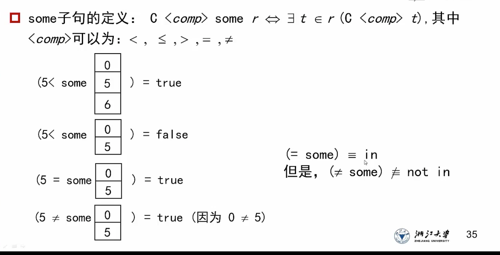
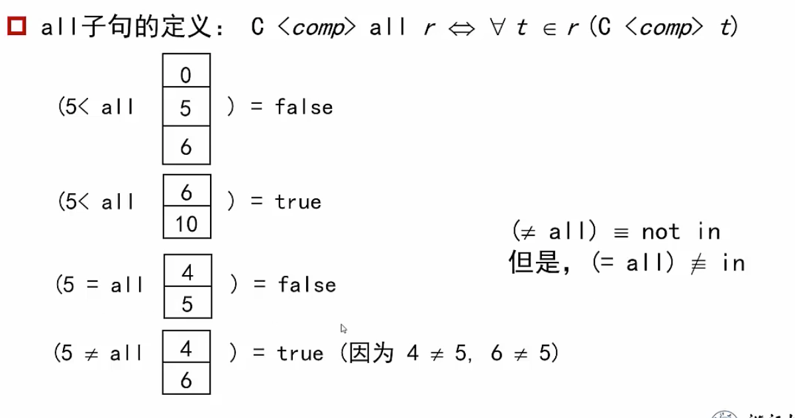

# SQL语言

## DDL数据定义语言

### 创建表

```mysql
create table instructor(
	ID char(5), # ID必须是一个5位的字符串，作为主键
	name varchar(20) not null, # name是一个20位以内的可变长度字符串且不能为空
    dept_name varchar(20),
    salary numeric(8,2), # 定点数，共有8位数字，其中2位在小数点右边
    primary key (ID),
    foreign key(dept_name) references DEPT, # 这张表中的dept_name是来自DEPT表中同名属性
    check(salary >= 0); # 检查录入的每个元组中工资是否为负数
);

drop table instructor; # 删除表
alter table instructor add birthday varchar(10); # 给instructor表增加一个生日的属性，所有已有的元组在这一个属性上取值均默认为null
alter table instructor modify(ID char(10)) # 把表中ID属性的域扩展为10字符的字符串
alter table instructor drop birthday # 删除生日属性
```

其他常见数据类型：

```mysql
int # 整形
smallint # 小整数类型
float(n) # 精度至少n位的浮点数
real precision# 单精度浮点数
double  precision #双精度浮点数
```

常见的函数

```mysql
abs()绝对值
exp()指数
```

<font color = red>在check中，检查的结果只要不是false，就都是合法的输入。unknown也是合法的</font>


## 查询语言

```mysql
select distinct name # distinct会使得选择出来的元组会去除重复 。如果保留重复，可以换为all（默认就是all）
from instructor
where instructor.name = "C" and instructor.salary > 100;
```

1. select的一些查询

```mysql
select * # 所有属性
select ID,name, salary*1.05; # 将查询结果直接进行简单的算术运算
```


2. where的使用

   ```mysql
   select name as instructor_name # 更名运算
   from instructor, teachers
   where instructor.salary between 100 and 200 and instructor.ID = teachers.ID;
   ```

   

   

3. 字符串运算

   ```mysql
   # 采用关键字like进行字符串匹配
   select dept_name
   from department
   where building like '%watson_\%' #匹配的字符串应当包含watson关键字，且这个关键字后只能有一个字母。%匹配任意子串，_匹配任意字符,\转义关键字
   # 一些函数：upper（）全转为大写字母，lower转为小写字母，trim去掉字符串末尾的所有空格
   ```

4. 排序

   ```mysql
   select name 
   from instructor
   where dept_name = 'waston'
   order by salary desc, name asc ;#优先按照工资降序，工资相同按姓名顺序升序 
   ```

5. 集合运算

   并用`union`,交用`intersect`,减法用`except`

   ```mysql
   (select course_id
   from section
   where year = 2009 and cost = 100)
   intersect
   (select course_id
   from section
   where year = 2010 and cost = 200);
   ```

6. 聚集函数

   ```mysql
   select avg(salary) as avg_salary
   from instructor
   where dept_name = 'Biology';
   ```

   ```mysql
   select avg(salary) as avg_salary
   from instructor
   group by dept_name # 利用group进行分组	
   ```

   <font color=  red>聚集函数使用后，只能使用having关键字进行进一步筛选</font>

   ```mysql
   select avg(salary) as avg_salary
   from instructor
   group by dept_name
   having avg(salary) > 42000;
   ```

7. 空值的处理

   ```mysql
   select name from instructor
   where salary is null ;# null必须使用is关键字进行描述，不能用等号
   ```

   规定：

   1. null：count以外的聚集函数都会忽略null
   2. 空集：空集的count运算值为0，其他的聚集函数运算结果为空值null 


## 嵌套子查询

子查询嵌套在另一个查询的where子句中

```mysql
# 查找春秋学期均开课的课程
select distinct course_id
from section
where year = 'Fall' and course_id in
(select course_id
from section 
where year = 'Spring');
```


### 用于比较操作

比较操作的时候，可以采用some关键字表示“至少比某一个大”

```mysql
# 找出这些教师的名字：他们的工资至少比生物系某个教师工资高
# 非嵌套的写法
select distinct name
from instructor as T, instructor as S
where T.salary > S.salary and S.dept_name = 'Biology';

# 嵌套写法
select distinct name
from instructor as T
where T.salary > some(
  select salary 
  from instructor as S
  where S.dept_name = 'Biology');
```

some关于bool类型变量的判断方式



同理，关于关键字`all`的bool变量判断：



```mysql
# 找出平均工资最高的系的名称
select dept_name
from instructor
group by dept_name
having avg(salary) >= all(
	select avg(salary)
	from instructor
	group by dept_name)
```


### 存在关系测试

1. 采用关键字`exists`，检查是否存在符合条件的元组

```mysql 
# 选出09年和10年均开设的课程号
select course_id
from instructor as S
where year = 2009 and exists (
  select *
  from section as T
  where year = 2010 and S.course_id = T.course_id);
# 思路：外层的第一个查询查找出09年开设的课程，然后检查是否存在于10年开设的课程中，如果存在，则是符合的课程 
```


2. 采用存在性布尔函数`unique`查询是否存在重复元素，没有重复元素的时候返回true

   ```mysql
   # 找出09年最多开设一次的课程
   select T.course_id
   from course as T
   where unique(
     select R.course_id
     from course as R
     where T.course_id = R.course_id and R.year = 2009)
   # 思路：内层的查询找到所有09年的课程，并检查单次，然后利用id提取id（unique只返回bool值，所以需要重复一次打印id）
   ```

   

### with关键字

提供定义临时关系的方法，也就是可以用with构造一张临时表

```mysql
# 找出具有最大预算的系
with max_budget(value) as (
 	select max(budget)
  from department
)
select budget
from department，max_budget
where department.budget = max_budget.value
```

