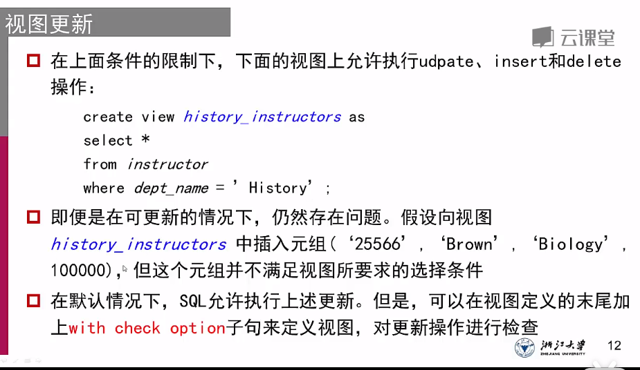

# 视图与索引


## 视图

通过查询来定义虚关系，相当于固定了一个查询方式，但并不会保留查询结果

```mysql
# 找出2009年物理系开设的课程和上课教室
create view Physics_2009 as 
select course_id, buliding, room_number
from course, section
where course.deptname = 'Physics' and 
	course.course_id = section.course_id and 
	course.year = 2009
```

视图本身可以视为一个关系表

```mysql
select course_id 
from Physics_2009
where course_id = '123'
```


### 视图的插入

```mysql
# insert a new tunple to the view named 'faculty'
insert into faculty values('12345', 'Green', 'Music', null);
# 如果最后的null没有写上去，那么有可能会返回一个错误信息并拒绝插入
```

1. 新插入视图的数据中，可能包含不存在的外键，这时候需要检查视图是否可更新

   ```mysql
   insert into instructor_info values('69987', 'White', 'Taylor');
   # 假如没有69987为ID的职工，也没有位于Taylor大楼的教室。如果直接去原始表更新building的数据库，由于该表中能填入的有效信息只有一个Taylor，可能会出现主键为null的情况
   ```

   检查视图是否可更新的条件：updatable，才可以执行插入，更新和删除，需要同时满足下面四个条件

   1. from子句只有一个数据库关系
   2. select不包含计算结果，聚合函数以及distinct
   3. 查询中没有group by
   4. 没有出现在select中的属性可以取null


2. 就算视图满足四个条件，但可能会在更新的时候出现数据不符合定义的错误，此时需要使用`with check option`
   


### 物化视图

为了提高常用视图的访问效率，引入物化视图。物化后的视图会将检索的结果保留在数据库中

#### 物化视图维护

共有三种维护方式

1. 视图的定义被更新时，进行视图维护
2. 视图被访问的时候，进行视图维护
3. 周期性视图维护（可能会有过时数据）


## 索引

为属性创建索引，可以方便找到在索引属性上取给定值的元组

```mysql
create unique index ID_index on student(ID) # 给学生表中的ID属性创建爱唯一索引
drop index ID_index # 删除索引
```

1. 唯一索引`unique index` 只能为==主键==创建

 