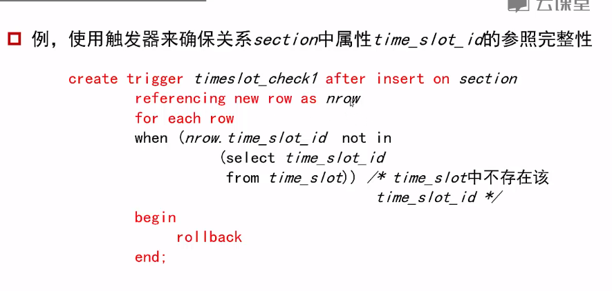

# 事务

## 事务的特性

1. 原子性：事务在完成所有步骤后，要么执行成功并提交，要么执行不成功并回滚所有不成功的动作
2. 一致性
3. 隔离性
4. 持久性


### 自成事务

SQL语句默认方式下自成事务，一旦执行完一句就提交。如果一个事务要执行多个SQL语句，就必须手动关闭SQL语句的自动提交

1. SQL：1999标准允许多条SQL语句包含在关键字begin atomic …… end之间


### 完整性约束

保证用户对数据库的修改不会破坏数据一致性 

1. 保证关键数据不为NULL
2. 不存在相同的主键
3. 预算必须大于0
4. course中每个系的名字必须在department关系中登记过


#### 完整性种类

1. 域完整性
2. 实体完整性：主键约束
3. 参照完整性：外键约束
4. 用户自定义完整性约束

完整性约束由DBMS维护


### 单个关系的约束

```mysql
create table instructor(
ID char(5) primary key,
    name varchar(20) not null,
    salary numeric(8,2) not null,
    check (salary > 0)
);
```


### 域约束

检测插入到数据库中的数据的合法性

```mysql
create domain Dollars as numeric(12,2) not null
create table instructor(
ID char(5) primary key,
name varchar(20),
salary Dollars);
```

check子句也可以应用到域

```mysql
create domain YearlySalary numeric(8,2)
constraint salary_value_test check(value >= 29000)
# salary_value_test 是约束的名字，指明一个更新违反了该约束
# 约束的内容是检查使用这个约束的属性的值需要大于29000
```


还可以使用in限定一个域只包含指定的一组值

```mysql
create domain degree_level varchar(10)
constraint degree_level_test 
check (value in ('Bachelors', 'Masters', or 'Doctorate'));
# 规定使用degree_level这个域的属性只能在三个给定的属性里挑选一个
```


### 参照完整性

```mysql
# 外键引用的三种格式
foreign key (dep_name) references department
dept_name varchar(20) references department
foreign key(dep_name) references department(dep_name)
```

#### 级联操作

```mysql
create table course(
foreign key(dept_name) references department[on delete cascade][on update cascade],
);
```

从而实现级联删除和级联更新

如果存在多级级联，且中间某一级的约束不能进行下去，则系统会终止该事务并回滚	


## 断言assertion

### 语句形式

```mysql
create assertion credits_earned_constraint check(
    not exist(
    select ID
    from student
    where tot_cred<>(
    	select sun(credits)
    	from takes, course
    	where student.ID = takes.ID
    	and grade is not NULL))
);
# 最下面最内层的查询，列出了所有学生选修的课程学分之和
# 中间的查询，检查student表中tot_cred这个属性是否和下面计算的累计值相等，如果不相等，则加入返回的集合中
# 最上面最外层的断言，检查中间查询出的集合是否为空。如果为空，说明是表是合格的，所有数据吻合。如果不为空，说明存在数据不吻合的情况
```

创建断言后，系统将检查其合法性，并对每一个可能破坏该断言的数据库更新进行检测，开销会很大


# 触发器trigger

由数据库更新操作引起的被系统自动执行的语句

触发器必须指明触发器被执行的条件，以及执行时所需要做的具体动作



 

# 数据库安全性

## 授权机制

### 第一种划分机制

#### 数据库系统级

采用验证和授权机制使用户存取特定数据


#### 操作系统级

操作系统里的root用户可以对存放在系统里的数据库文件本身做拷贝和删除，需要防范


### 网络级

防止偷听和伪装


### 物理级

防止数据的物理损坏


### 人员级

审查用户确保口令不会泄露


## 安全方式

### 视图授权

```mysql
# 规定一个员工只能查看geology系的所有员工工资，看不到其他系的员工工资
# 禁止员工对数据库的直接访问，仅提供视图geo_instructor的访问
create view geo_instructor as(
select * 
from instructor
where dept_name = 'geology');
```


### 权限授予

1. 收回某个用户权限的时候，要记得收回更低级用户的权限。但如果某个更低级用户的权限是从多个用户处获取，则需要视情况收回
2. 循环授权可以存在，但其中一个用户被消除，其他的用户也都会被消除权限

```mysql
# 可以授予的权限包括：select, insert, update, delete, reference(允许在创建关系的时候建立外键), all privileges
# with grant option允许用户把授予的权限进行转授
# 角色role
create role instructor;
grant select on takes to instructor ;# 将在表takes中执行select的权利赋给角色instructor
create role dean; #再创建一个dean的角色
grant instructor to dean; # 将instructor角色的权利授予dean
```


### 权限收回

```mysql
revoke select on takes from instructor, dean cascade #从instructor和dean两个角色收回对takes的select权限，并采用级联（cascade）收回的方式
# 如果要防止级联删除，则将cascade换为restrict。采用restrict的指令在遇到级联的情况会执行失败
```

授权的局限性：

1. 不支持元组级授权：不能让学生只看到自己的分数
2. 某些应用的所有最终用户可能被映射为单个数据库用户


### 审计更新

跟踪应用程序对数据库的更改

