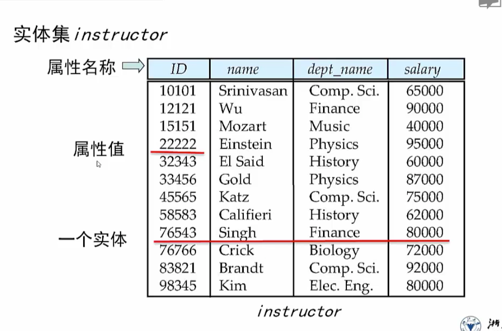
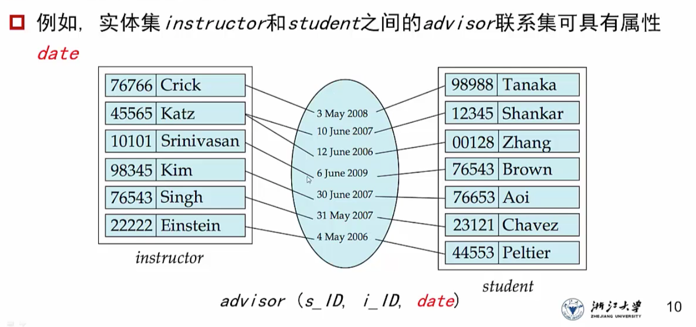
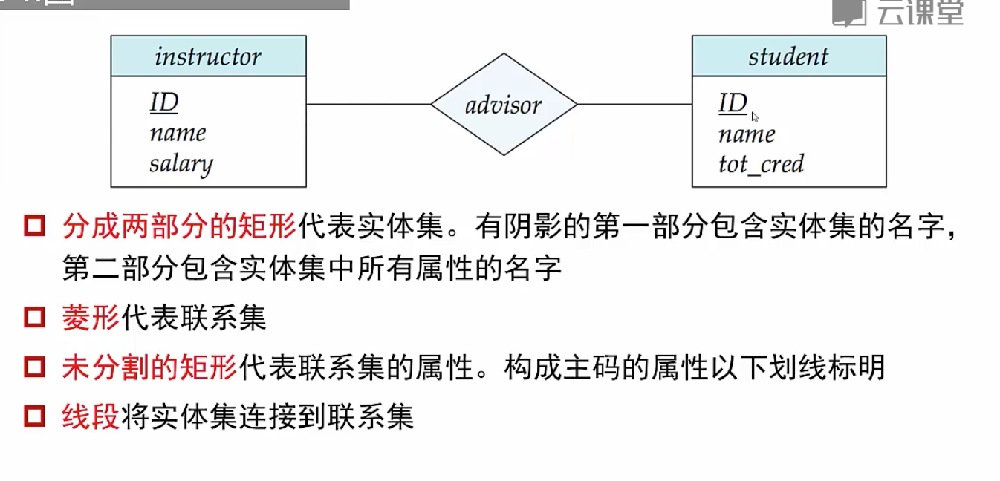
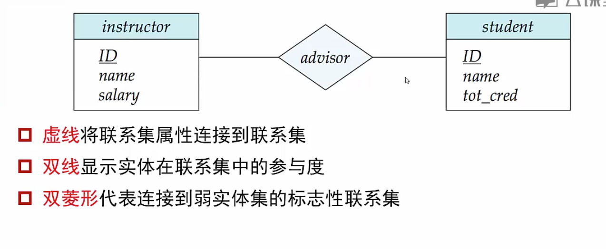
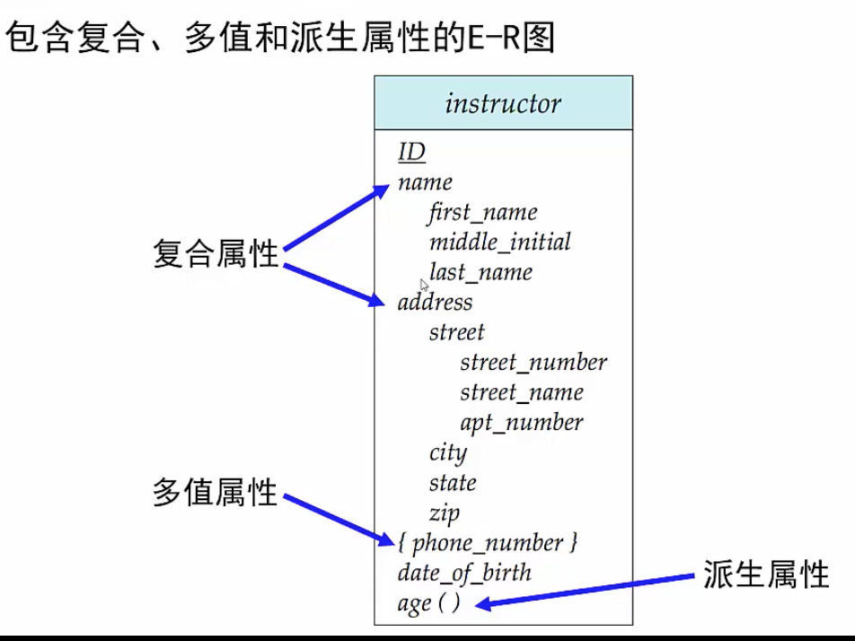

# ER图

## 集合种类

### 实体集

1. 具有属性，是所有相同类型的实体的集合

2. 一个实体集包括：属性名称，属性值和具体的实体。

   

3. 属性分为

   1. 简单属性和复合属性（姓名）
   2. 单值属性和多值属性（电话号码）
   3. 派生属性（年龄可以通过生日的数据计算得到）

###  联系集

指多个实体之间相互关联

1. 一个联系集包含多个同类联系
2. 一个联系集表示两个及以上实体集之间的关联

3. 联系集也有属性

   

   date标记了老师指导学生的开始日期

#### 联系集的度

指参加联系的实体集的个数，涉及两个实体集之间的联系集称为二元联系

#### 映射基数

表达一个**<u>实体</u>**通过联系集进行关联的其他**<u>实体</u>**的个数

发生映射的时候，两个集合中可能都存在一部分元素未参与映射

#### 码键值

1. 参与一个联系集的各实体集的码的组合，构成该联系集的超码
2. 联系集的候选码依赖于联系集的映射基数
   1. 如果是多对多映射，那么需要两个实体集的超码共同构成联系集的候选码
   2. 如果是一对多，那么一的一方的候选码就可以直接作为联系集的候选码
   3. 如果是一对一，任意一方的候选码都可以作为联系集的候选码

## ER图表示

1. **<u>单线表示部分参与联系，双线表示全部参与</u>**
2. 

