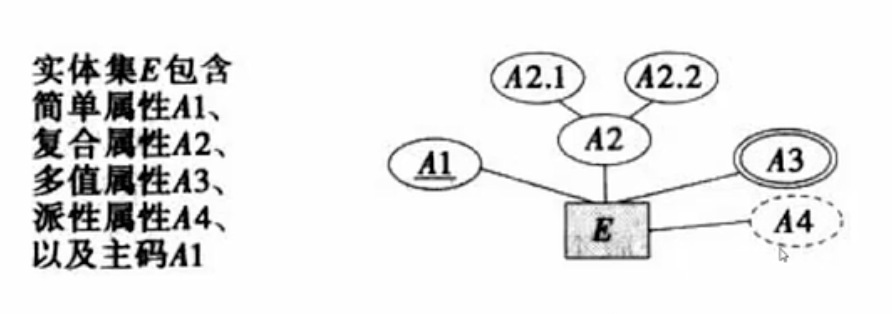
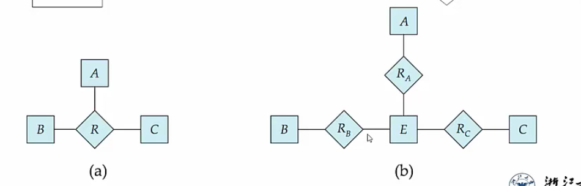
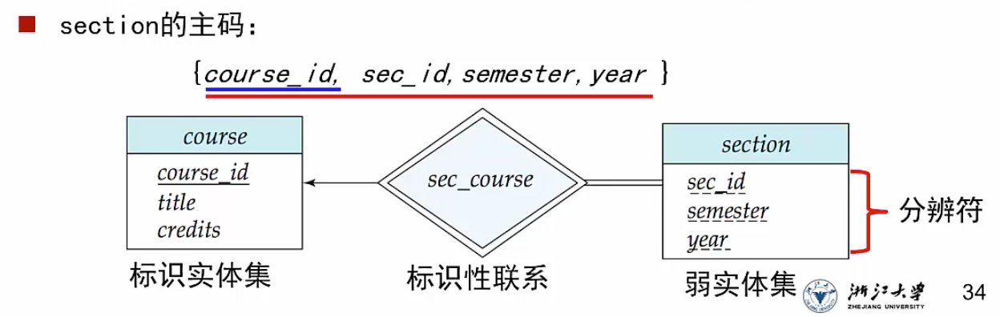
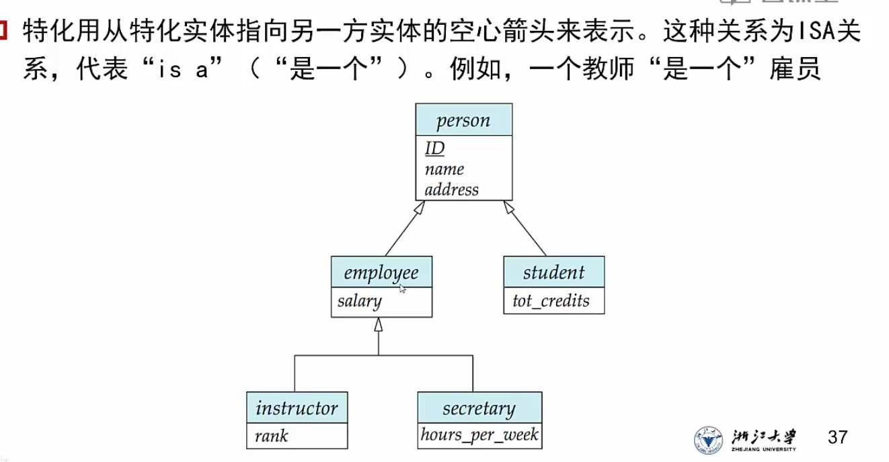
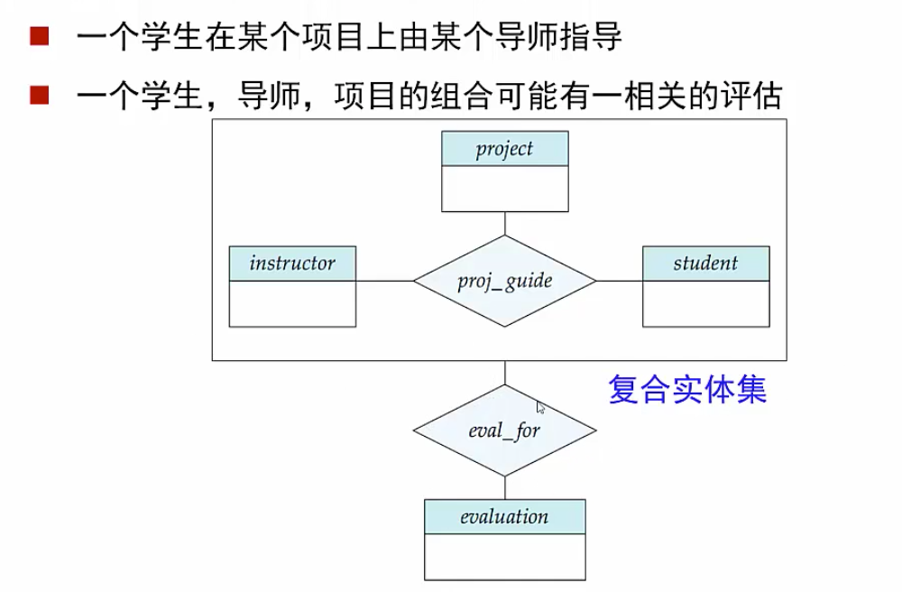
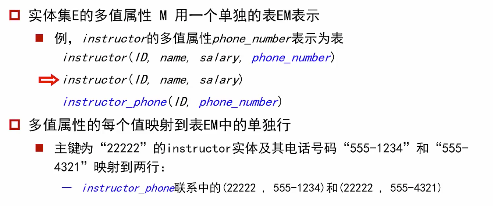

# ER图

## 集合种类

### 实体集

1. 具有属性，是所有相同类型的实体的集合

2. 一个实体集包括：属性名称，属性值和具体的实体。

   

3. 属性分为

   1. 简单属性和复合属性（姓名）
   2. 单值属性和多值属性（电话号码）
   3. 派生属性（年龄可以通过生日的数据计算得到）

###  联系集

指多个实体之间相互关联

1. 一个联系集包含多个同类联系
2. 一个联系集表示两个及以上实体集之间的关联

3. 联系集也有属性

   

   date标记了老师指导学生的开始日期

#### 联系集的度

指参加联系的实体集的个数，涉及两个实体集之间的联系集称为二元联系

#### 映射基数

表达一个**<u>实体</u>**通过联系集进行关联的其他**<u>实体</u>**的个数

发生映射的时候，两个集合中可能都存在一部分元素未参与映射

#### 码键值

1. 参与一个联系集的各实体集的码的组合，构成该联系集的超码
2. 联系集的候选码依赖于联系集的映射基数
   1. 如果是多对多映射，那么需要两个实体集的超码共同构成联系集的候选码
   2. 如果是一对多，那么一的一方的候选码就可以直接作为联系集的候选码
   3. 如果是一对一，任意一方的候选码都可以作为联系集的候选码
3. 采用箭头的方式表示一，不带箭头的表示多。还可以使用`1…*`表示`至少要有一个映射，最多可以映射全部`

## ER图表示

1. 

1. **<u>单线表示部分参与联系，双线表示全部参与</u>**

2. 因此，如果是双线+箭头的表示方式，表示的是“全部参与并且是一的映射基数”

3. 映射基数限定了关联的数目上限，全参与和部分参与定义了参与关联的数目下限

4. 如果采用了lh（直接写明上下限）的表示方法，就不需要使用单双线和箭头来表示了

5. 在ER图中，实体集的属性画法

   

   1. 简单属性采用椭圆，主码属性要画下划线
   2. 复合属性在自己列出的基础上还要继续用椭圆列出子属性
   3. 多值属性需要用双椭圆表示
   4. 派生属性用虚线画椭圆

### 二元实体集的转换

任何一个非二元的联系都可以转换为多个二元联系，方式是建立一个额外的实体集

对于一个三元联系包含实体集ABC，可以建立四个额外的实体集：

1. 创立一个实体集E， 包含联系集的所有属性，并创立一个额外的标志属性
2. 再创立三个实体集Ra，Rb，Rc来分别作为ABC与E之间的联系 、

## 强弱实体集

### 弱实体集

没有主键的实体集是弱实体集

弱实体集的存在依赖于它的标识实体集（也就是属主实体集的存在）

1. 标识性练习：将弱实体集与其标识实体集相联的联系

2. 标识性联系是弱实体集到标识实体集多对一的，弱实体集在联系中是全部参与的

3. 分辨符/部分码：在一个弱实体集内区分所有实体的属性集合

4. 一个弱实体集的主码由其所依赖的强实体集的主码 + 弱实体集自己的分辨符组成

   图中，section是弱实体集，其所有属性共同构成了其分辨符，course作为属主实体集，其主键course_id与分辨符混合构成了主码

   course_id并不会显示的写入section中，而是通过系统自行判断连接

   

#### 表示

1. 弱实体集的分辨符用虚线在实体集中标出
2. 关联弱实体集和强实体集的联系用双菱形表示

## 特化与概化

### 特化

确定实体集中的一个具有特殊性质的子集

类似于C++的父类和子类的关系，数据库中存在一个父类，特化出的子类继承了这个父类的所有属性，并可以添加自己特有的属性成为一个新的类

1. 子类的正确称呼是<u>**低层实体集**</u>

### 概化

将多个有相同特性的实体集组成一个高层实体集，与特化互逆

### 聚集

将联系视为一个实体集，如果不采用聚集的方式，可能会导致同一组实体集需要建立多个联系，导致ER图冗余

### 特化/概化的设计约束

#### 特化

1. 条件定义：特化的时候，可以通过定义条件进行划分子类（比如student中，grade=大四的学生才可以特化为毕业生）
2. 用户定义：直接定义某个角色属于特化的子类（手动划分人员角色为生物还是数学教师）

## ER图转表

### 实体集转表

1. 强实体集直接转成表就行

   1. 复合属性中，每个复合属性还需要单独建立一个表，表的名称是复合属性的名字，属性是复合属性的子属性
   2. 多值属性也需要单独建立一个表，表的内容由原表的主键+多值属性构成

   

2. 弱实体集需要将标识强实体集的主键加入自己的属性列

3. 联系集（见思维导图）

   1. 包含参与的两个实体集的所有主键，以及自己的属性列
   2. 在一对多的联系中，如果多的一方是完全参与的，那么可以省略联系集，并将“一”的一方的主键加入多的一方实体集属性中
      1. 如果多端是部分参与，那么会使得多的一方的表中，一的一方的主键属性上产生null，但由于这张表中该属性不是主键，所以为null也是可以的

4. 弱实体集和强实体集联系的时候，弱实体集可以省略不写

