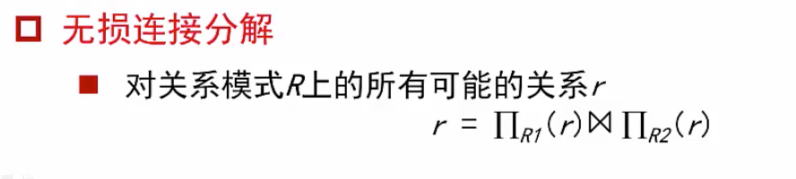
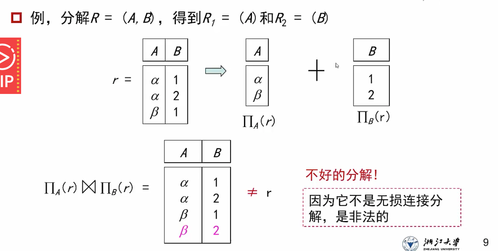
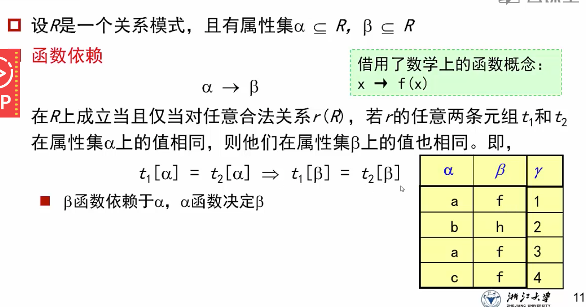
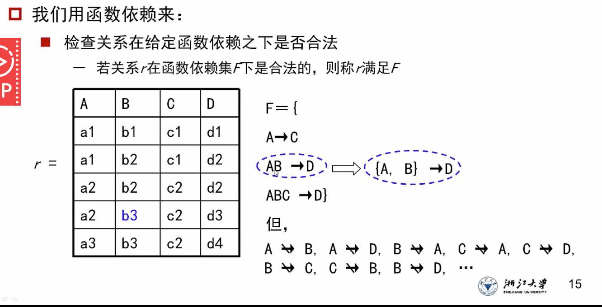
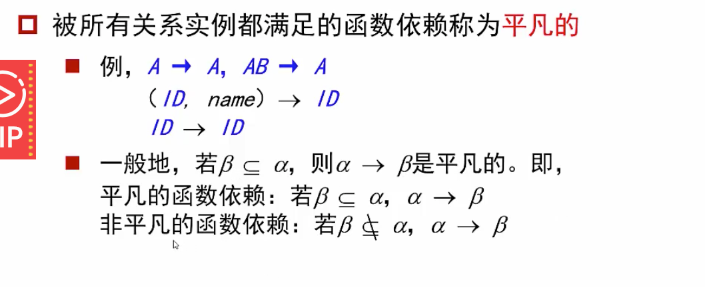
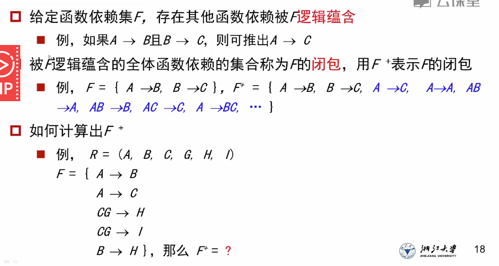

# 范式

## 第一范式

### 定义

1. 如果某个域中的元素是不可分的，那么这个域是原子的（也就是属性不是复合的或者多值的）
   1. 对于多值属性，每个属性单独创建一个元组
   2. 对于复合属性，将属性拆分开单独作为属性
2. 如果关系R的所有属性都是原子的，那么R就是第一范式1NF

## 异常

1. 更新异常：修改表的时候导致数据不一致的情况
2. 插入/删除异常：使用了空值，导致外键为空
3. 浪费空间：重复数据导致冗余

### 解决方案：模式分解

原模式R所有属性分离为多个模式R1，R2……

但是R的所有属性必须都存在于R1，R2的并集中

#### 分解要求：无损连接

对于R上的所有可能关系r

没有同属性的情况下，自然连接 = 笛卡尔积

### 检测无损连接的理论

#### 函数依赖

##### 依赖集

##### 平凡的函数依赖

被所有关系实例都满足的函数依赖是平凡的

如果一个数据库中存在某些元组r不符合一个依赖F，那么这个F就是不平凡的

### 检测保持依赖

如果一个依赖集F分解为两个子依赖集F1和F2

分解的时候，将F1中所有属性相关的依赖加入到F1中，同理对F2

将F1和F2中的所有依赖关系做并集，然后做这个并集的闭包

看得到的闭包是否和原来的依赖集F一致。

见notability12页

## 闭包

### 闭包的计算方式

1. armstrong公理及三个推广公式：notability
2. 往往先用自反率和增补率，然后再用传递率，如此循环

### 闭包的作用

1. 判断属性集a是否为超码
   1. 计算依赖集F下由a确定的所有属性的集合，也就是由a能否推出一个完整的属性集（notability）
2. 计算一个关系R的候选码：notability

## 正则覆盖Fc

如果一个依赖集F很大，那么每次更新数据库就要做很久的检查

正则覆盖确保了一个函数依赖集是最简洁的，且不会损失任何依赖关系约束

### 特点

1. Fc中的任何函数依赖都不包括无关属性
2. Fc中的函数依赖左半部都是唯一的

### 检测属性是否无关

