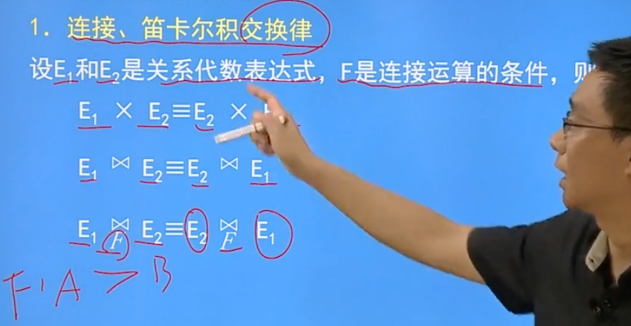
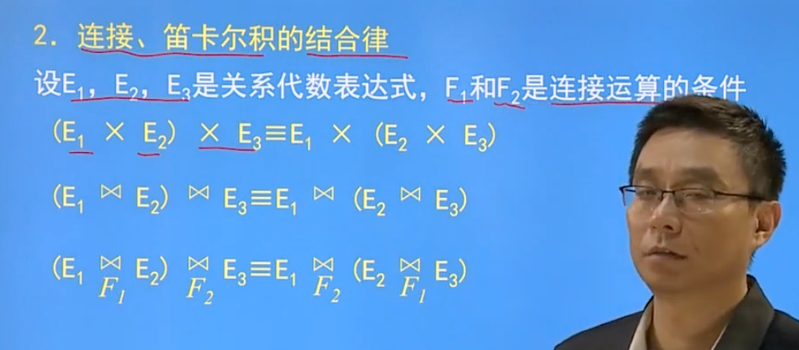
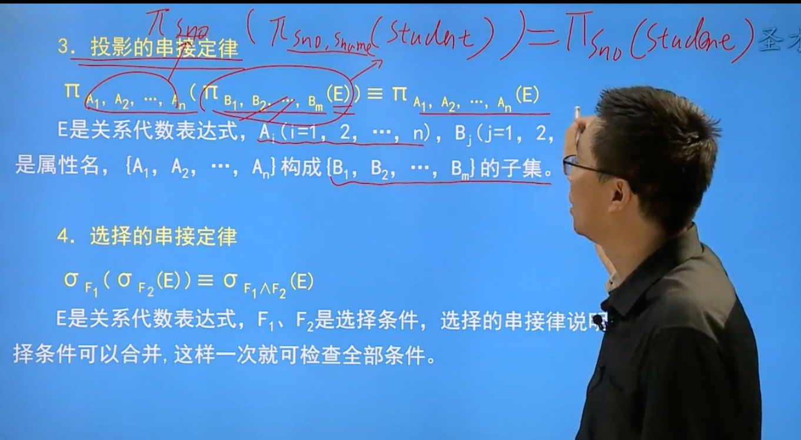
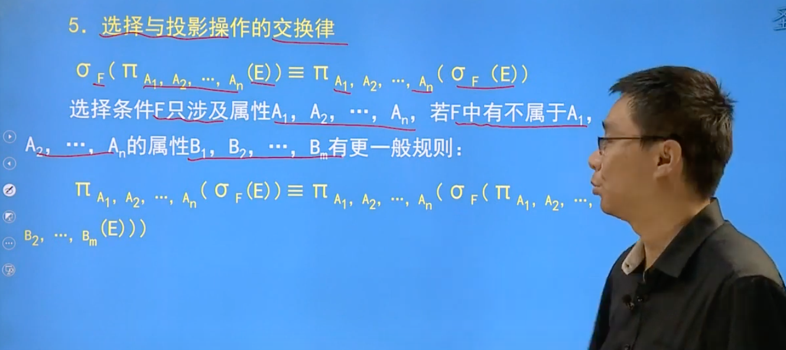
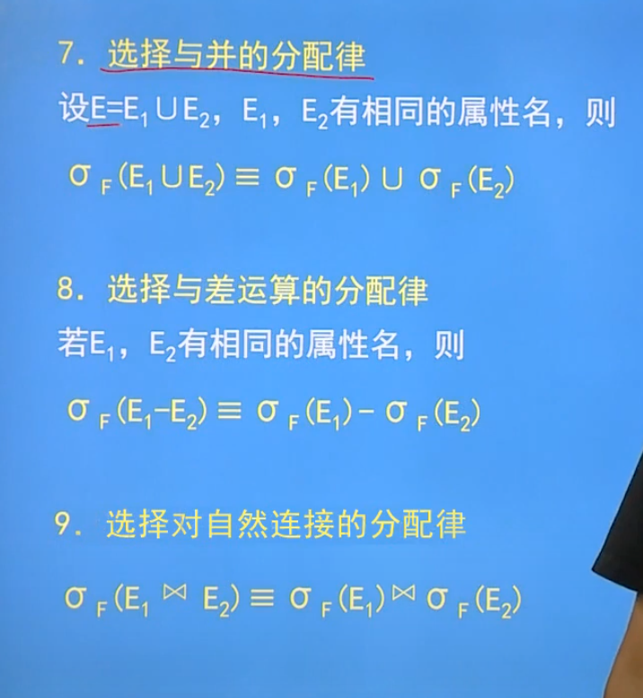
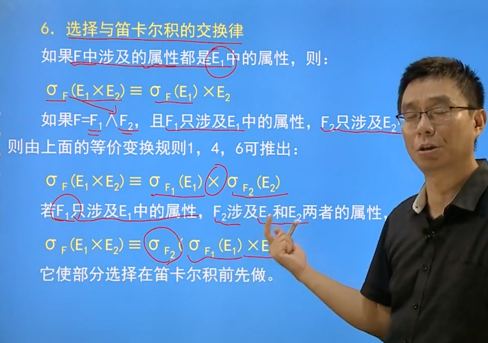

# 查询优化

查询的步骤：查询分析，查询检查，查询优化，查询执行

## 查询分析

进行词法分析，语法分析，对查询语句进行扫描

## 查询检查

1. 合法性检查：检查属性名，属性是否存在，关系是否存在
2. 视图转换：如果是对视图的操作，那么要把对视图的操作转为对基本表的操作
3. 安全性检查：检查用户权限和操作的完整性约束

查询检查之后，SQL查询语句会转为内部表示，也就是查询树

## 查询优化

### 分类

1. 代数优化/逻辑优化：按照规则对查询进行等价变化，修改执行次序使得查询执行更加高效
2. 物理优化：存取路径和底层操作算法的选择

### 优化的依据

1. 基于规则
2. 基于代价
3. 基于语义

### 查询的实现

#### 查询方式

1. 全表扫描：逐行扫描检查每个元组，适合小表
2. 索引扫描方式
   1. 适用于属性上有索引的表，通过索引找到满足条件的元组

### 连接操作

对AB两个表进行自然连接操作

1. 嵌套循环算法
   1. 从A中选取一个元组，到B中检查自然连接的属性中是否存在相等的元组，合并
   2. 循环第一步操作
2. 排序合并算法
   1. 和嵌套算法基本相似，只是对连接属性先排序
   2. 这样找到第一个不相同的元组时，就可以停止扫描了
3. 索引连接算法
   1. 查询元组的时候采用索引的方式进行查找
4. hash join算法
   1. 划分阶段：对元组数目较少的表，将其元组按照hash函数分散到hash表的桶中
   2. 试探阶段：对包含元组较多的表，按照同样的hash函数散列，将hash值相同的元组进行连接
   3. 使用该算法的前提是，较小的表在划分阶段可以完全放入内存的hash桶中

## 查询等价变换

### 规则

1. 笛卡尔积交换律

2. 笛卡尔积结合律

3. 投影的串接定律，选择的串接定律
4. 选择与投影的交换律
5. 选择分配律
6. 选择与笛卡尔积的交换律

### 优化原则

1. 选择运算尽可能先做
2. 投影运算与选择运算同时进行
3. 先投影，再做双目运算（比如笛卡尔积）