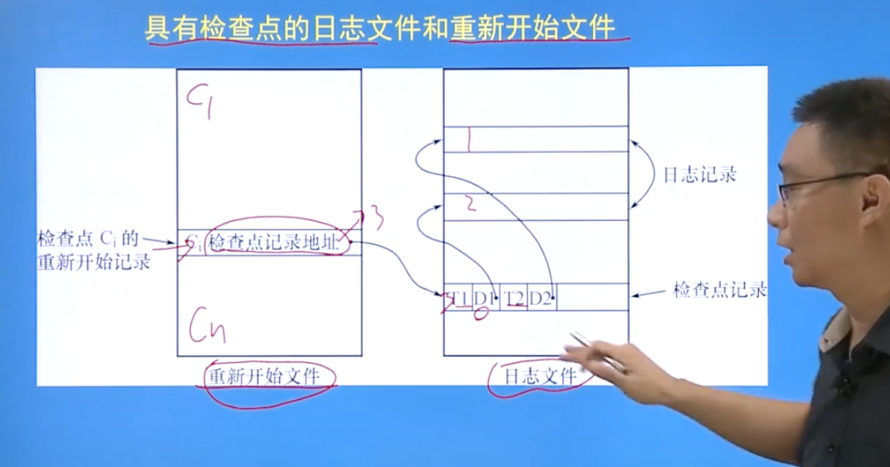
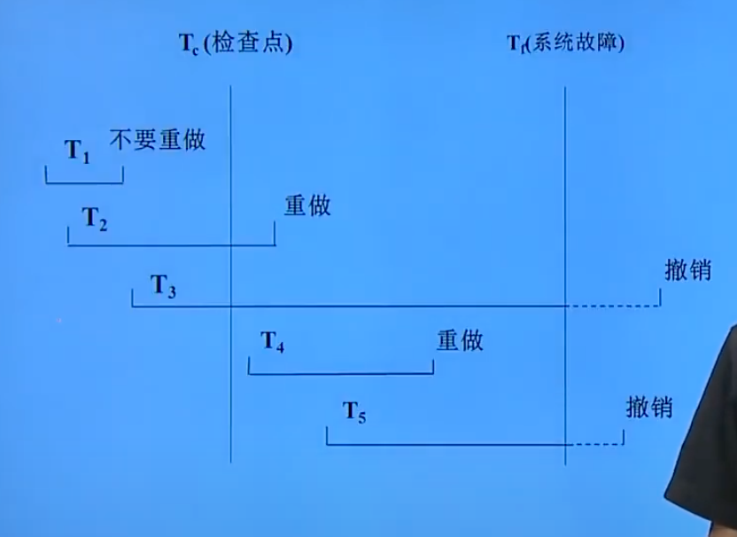

# 事务

## 事物的定义

```mysql
# 成功的事务执行显示声明
begin transaction;
SQL 语句;
commit;
# 需要回滚的事物执行:执行SQL的时候发生了故障
begin transaction;
SQL语句;
rollback;
```


## 恢复技术

### 数据转储

管理员定期将数据库复制到其他磁盘上保存，作为备份副本

如果原始数据故障，需要将备份数据恢复到原始服务器上后，重新执行备份以后所有的操作


#### 转储方式

1. 静态转储：在系统中没有事务运行的时候进行转储。期间不允许任何存取修改活动
   1. 会降低可用性，因为用户必须等到转储结束之后才能继续使用数据库
2. 动态转储：转储期间数据库依然可以进行读取修改
   1. 不能保证副本中的数据正确
   2. 一般需要备份副本+日志文件才能将数据正确保存

3. 海量转储：每次存储所有的数据

   1. 对应的增量转储：只转储更新的数据部分

      

### 日志文件

记录事务的更新操作

#### 分类

1. 以记录为单位的日志文件
   1. 记录事务的开始标记，结束标记，每个事物的更新操作，这三个信息作为一个日志记录
      1. 内容：事务标识，操作类型（增删改查），操作对象，更新前旧值（insert操作为空），更新后新值（delete操作为空）
2. 以数据块为单位的日志文件
   1. 记录被更新的数据块以及事物标识


日志的登记顺序

1. 登记的次序严格按并发事务执行的时间次序
2. 必须先写日志文件，后写数据库
   1. 如果写完了日志没有执行数据库的操作，也就是多作一次undo，没有实质性丢失

### 恢复策略

#### 事务故障的恢复

事务在运行到正常终点前被终止

操作

1. 反向扫描文件日志，查找更新操作
2. 逆操作日志，将更新前的值写入数据库
   1. 插入操作的逆操作相当于删除操作
   2. 删除操作的逆操作相当于插入操作


#### 系统故障的恢复

> 可能的原因：
>
> 1. 未完成的事务对数据库的更新可能已经写入数据库
> 2. 已提交的事务更新可能还在缓冲区没有写入数据库
>
> 系统故障的恢复在系统重启的时候自动完成，不需要人工干涉

处理方式：

1. undo（撤销）故障没发生时候的事务
2. redo（重做）已经完成的事务


##### 步骤

1. 正向扫描日志文件，找出故障前已经提交的事务，加入重做队列，找出未完成的事务，加入撤销队列
2. 加入撤销队列的事务，对每个撤销事务反向扫描日志文件，执行逆操作
3. 对重做队列，每个重做事物要重新执行登记，


### 具有检查点的恢复技术

日志文件中增加检查点记录

#### 检查点

1. 建立检查点时刻所有正在执行的事务清单
2. 记录这些事务最近的一个日志记录的地址
3. 重新开始文件的内容
4. 记录各个检查点在日志文件中的地址



> Ci检查点记录了检查点在日志中的地址
>
> 系统去Ci指向的日志地址检查日志，发现该检查点时刻系统有T1和T2两个事务在执行，这两个事务的日志地址分别是D1和D2
>
> 于是系统可以直接读取D1和D2两个地址，就可以进行undo操作，不需要遍历整个日志文件


##### 检查点建立步骤

1. 当前所有日志缓冲区里的日志记录写入磁盘

2. 在日志记录中建立一个检查点（先写日志）

3. 将当前数据缓冲区中的所有数据写入磁盘（后写数据）

4. 将检查点记录在日志文件中的地址写入一个重新开始文件

   > 重新开始文件：专门记录检查点在日志中地址的文件列表


##### 检查点恢复策略



1. 从重新开始文件中找到最后一个检查点
2. 从检查点找到所有事务的执行日志
3. 建立redo和undo的队列，并顺序遍历所有事务的执行日志
4. 如果找到了一个事务的开始日志`begin transaction`，那么把这个事物先放入undo队列
5. 如果随后找到了该事务的`commit`，则表明故障前事务已经提交，则把该事务从undo中提出，放入redo队列